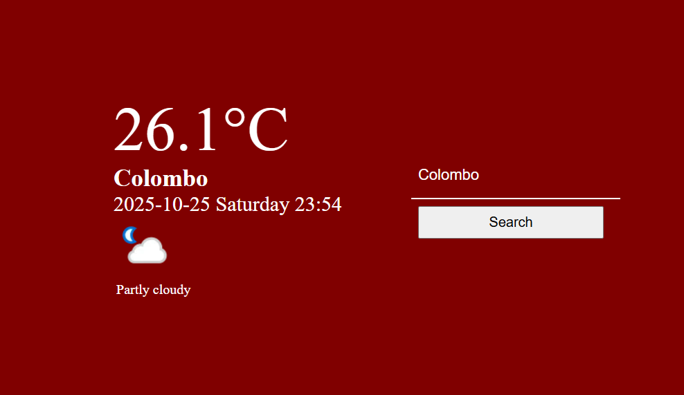

# Weather App 🌤️

A simple, responsive weather application that displays the current weather for any city using the [WeatherAPI](https://www.weatherapi.com/). Built with **HTML, CSS, and JavaScript**, this app shows temperature, weather condition, date, time, and a corresponding weather icon.

---

## Demo

Check out the live demo here:  
`https://<your-username>.github.io/weather-app/`  

---

## Features

- Search for any city in the world
- Display current temperature (°C)
- Show weather condition text and icon
- Show local date and time for the city
- Responsive layout for desktop and mobile

---

## Screenshot

  

---

## Technologies Used

- **HTML5** – Structure of the application
- **CSS3** – Styling and layout
- **JavaScript (ES6)** – Fetching API data and dynamic updates
- **WeatherAPI** – For real-time weather data

---

